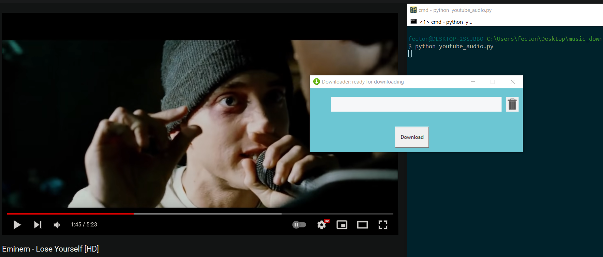
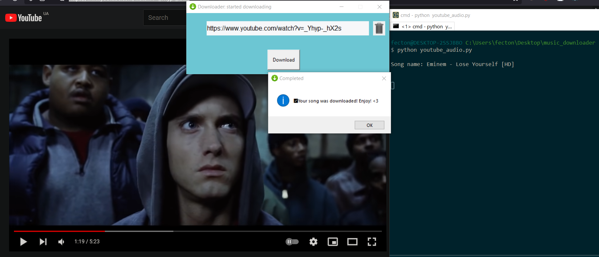
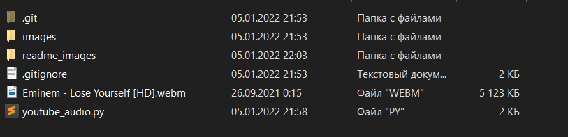
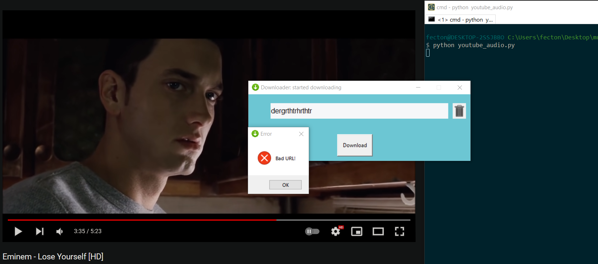
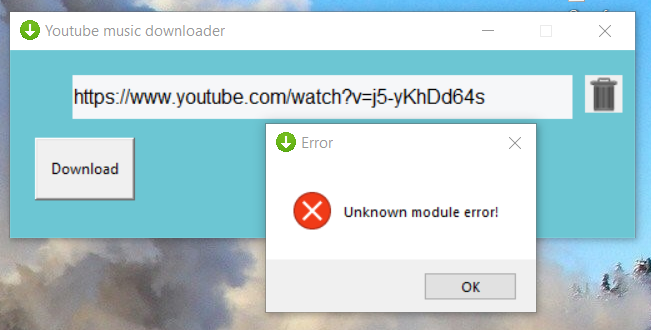
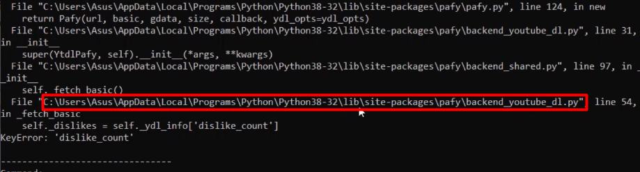
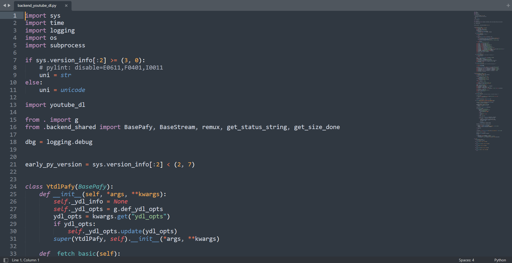
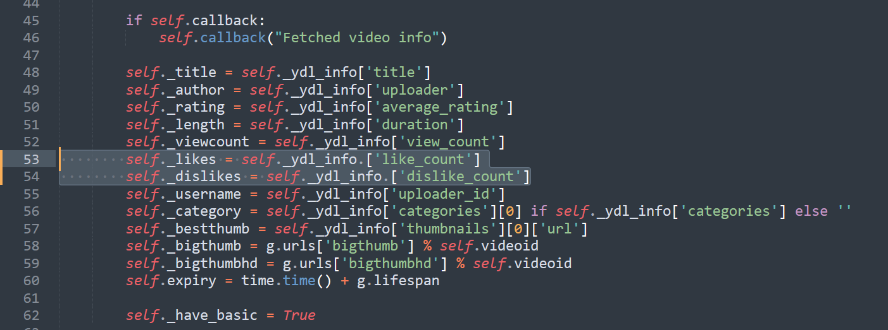
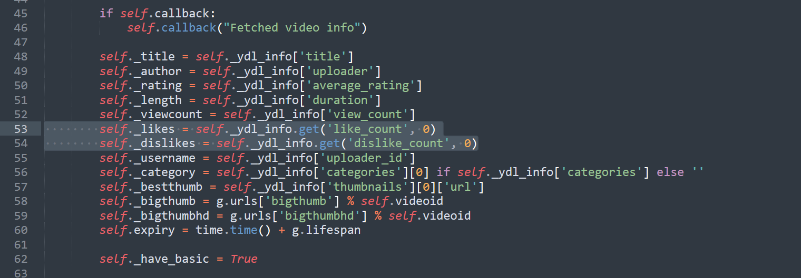

# YouTube music downloader on Python ♥

## Installing necessary modules:
```
pip install youtube_dl pafy
```
## Running:
```
python main.py
```

#
## Main window:


## Downloading:



# Errors
## Bad URL:


> It raised when you entered not youtube site or simple text

## Module error:


> It raises because pafy module have a disadvantage with dislike count, let's fix it!

> Get that path in the running console


> Go to that file


> Let's see the problem, there's here in lines 53-54:


> Let's correct it:

```
self._likes = self._ydl_info.get('like_count', 0)
self._dislikes = self._ydl_info.get('dislike_count', 0)
```


## Save and try again :)

### Thanks for using!